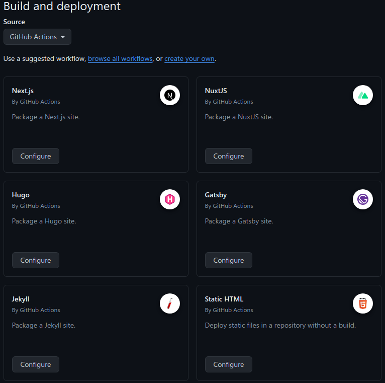

+++
title = '使用Hugo+Github Actions创建Github Pages'
date = 2024-07-29T19:09:57+08:00
draft = false
+++

## 简介

本篇教程将指导您如何使用 Hugo 和 Github Pages 创建搭建可以自动发布的个人博客页面。

不需要其他的博客描述的需要建立两个仓库的方法，直接使用Github Pages自带的[Github Actions](https://docs.github.com/en/pages/getting-started-with-github-pages/configuring-a-publishing-source-for-your-github-pages-site#publishing-with-a-custom-github-actions-workflow)功能和Hugo模板创建，在环境具备的条件下可以在10分钟内搞定。

本文假设您已经具有了以下的所有条件，本文不再重复介绍：
1. [Git](https://git-scm.com/book/en/v2/Getting-Started-Installing-Git)
2. Github账号
3. [Hugo](https://hugo.opendocs.io/installation/)

## 创建Github仓库

新建一个Github Repository，Repository Name填写为
{{username}}.github.io，请确保前缀和自己的用户名一样。

新建仓库后，在Settings页面找到Pages选项卡，将Source选择为Github Actions，选择后会出现多个模板，找到Hugo。



配置之后，Github会自动帮你在.github/workflows目录下生成一个hugo.yml文件，我们将其中的on.jobs.build.env.HUGO_VERSION设置为自己的Hugo版本号即可。

## 创建Hugo网站

### 创建网站
在本地运行以下命令，将以一个 [Ananke](https://github.com/theNewDynamic/gohugo-theme-ananke) 主题创建一个网站，将在当前目录下创建一个 quickstart 目录。

```
hugo new site quickstart
cd quickstart
git init
git submodule add https://github.com/theNewDynamic/gohugo-theme-ananke.git themes/ananke
echo "theme = 'ananke'" >> hugo.toml
hugo server
```
在终端中显示的 URL 中查看您的网站。

### 添加内容

向您的网站添加一个新页面
```
hugo new content/posts/my-first-post.md
```

Hugo 会在 content/posts 目录中创建该文件。使用编辑器打开该文件。

我们修改title后添加一些正文
```
---
title: "我的第一篇文章"
date: 2022-11-20T09:03:20-08:00
draft: true
---
## 简介

这是我的第一篇文章。

```

保存文件，然后启动 Hugo 的开发服务器以查看网站。您可以运行以下命令之一来包含草稿内容。

```
hugo server --buildDrafts
hugo server -D
```

如果文章没有问题，可以将 draft: true 修改为 false。

## 配置网站

打开项目根目录下的hugo.toml文件，将其中的baseURL修改为自己github的url：https://example.github.io/

language修改为zh-cn

```
baseURL = 'https://brave447.github.io/'
languageCode = 'zh-cn'
title = 'My Blog'
theme = 'ananke'
```

## 发布网站

将本地的Hugo仓库与刚才创建的Github仓库关联起来：

```
git remote add origin https://github.com/{{username}}/{{username}}.github.io.git
git fetch
github checkout -b main origin/main
git pull
```

提交本地的所有文件至远程仓库：
```
git add .
git commit "my first commit"
git push origin main
```
我使用 VS Code 作为IDE，push的时候会自动登录，不需要每次输入密码。

接着我们登录Github，找到自己仓库可以看到刚才的提交已经被推送到了Github上，正在执行流水线，Github会自动执行Hugo的编译程序并发布。

待流水线执行完毕，访问我们的博客地址：
https://example.github.io，便可以看到已经部署好的博客了。

